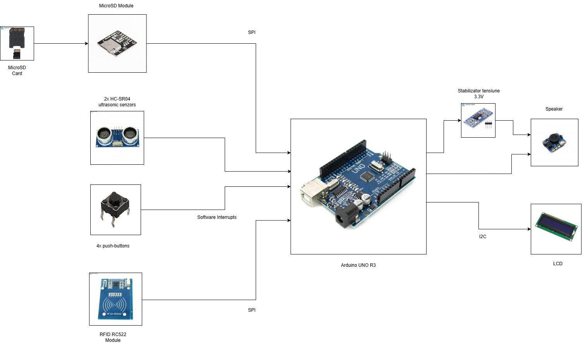
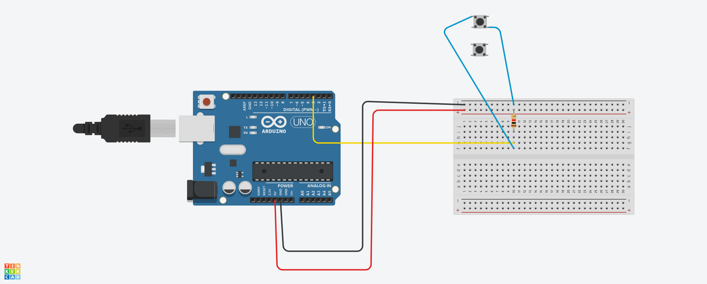
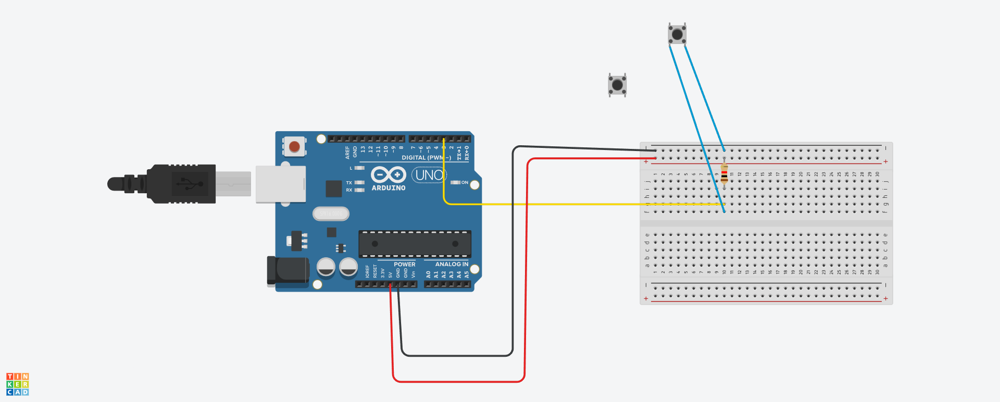

# Gym Assistant

## Introducere

TODO

## Descriere generala

TODO

## Hardware Design

### Lista piese

- Arduino UNO R3
- 4 x [push-buttons](https://ardushop.ro/ro/butoane--switch-uri/713-buton-mic-push-button-trough-hole-6427854009050.html)
- Ecran LCD 16x2 cu modul I2C
- Rezistente 220Ω
- [MicroSD Module](https://ardushop.ro/ro/module/1553-groundstudio-microsd-module-6427854023056.html?gad_source=1&gbraid=0AAAAADlKU-7r0Viay1-t361QlB21iOgs0&gclid=Cj0KCQjwqv2_BhC0ARIsAFb5Ac84XfsbeL3-M0mj8zEMxlvniXkfdQ1SGlEzoFS0otF-lMW6SyWNGnUaAvFmEALw_wcB)
- [Card MicroSD 16 GB](https://www.optimusdigital.ro/ro/memorii/8678-card-microsd-original-de-16-gb-cu-noobs-compatibil-cu-raspberry-pi-4-model-b-varianta-bulk.html?search_query=%090104110000057297%09&results=1)
  - Nu am gasit un card mai mic :( 
- [Speaker for Micro:bit](https://www.emag.ro/modul-difuzor-waveshare-36-52x43-44-mm-compatibil-cu-micro-bit-arduino-speakerformicro-bitwaveshare14542/pd/D785XQMBM/?ref=history-shopping_418333718_138738_1)
  - Cred ca erau si alte optiuni mult mai ieftine :) 
- [Stabilizator de 3.3 V](https://www.optimusdigital.ro/ro/electronica-de-putere-stabilizatoare-liniare/168-modul-cu-sursa-de-alimentare-de-33-v.html?search_query=0104110000000521&results=1) (pentru Vin al Speaker-ului)
- 2 x [Senzor ultrasonic HC-SR04](https://www.optimusdigital.ro/ro/senzori-senzori-ultrasonici/9-senzor-ultrasonic-hc-sr04-.html?search_query=0104110000000866&results=1)
- [Breadboard 830 puncte](https://www.optimusdigital.ro/ro/prototipare-breadboard-uri/8-breadboard-830-points.html?search_query=breadboard+830&results=15)
- [Fire Colorate Mamă-Tată](https://www.optimusdigital.ro/ro/fire-fire-mufate/878-set-fire-mama-tata-40p-30-cm.html?search_query=Fire+Colorate&results=49)
- [Fire Colorate Tată-Tată](https://www.optimusdigital.ro/ro/fire-fire-mufate/890-set-fire-tata-tata-40p-30-cm.html?search_query=Fire+Colorate&results=49)
- [Modul RFID RC522](https://www.optimusdigital.ro/ro/wireless-rfid/67-modul-cititor-rfid-mfrc522.html?search_query=rfid&results=37)

### Schema bloc

### Circuit Design

TODO

## Audio Files

https://y2mate.nu/en-CVeZ/
https://audio.online-convert.com/convert-to-wav

# Conectarea butoanelor

- Data Sheet Push-Buttons: <https://wiki-content.arduino.cc/documents/datasheets/Button.pdf>
- <https://components101.com/switches/push-button>

> Picioursele care formeaza o line sunt **direct conectate**.

Inainte de a face cablajul intre butoanele de pe cutie si breadboard,
am facut urmatoarele *"simulari"* in TinkerCAD.
Asa trebuie sa arate conexiunea cu un push-buton:

